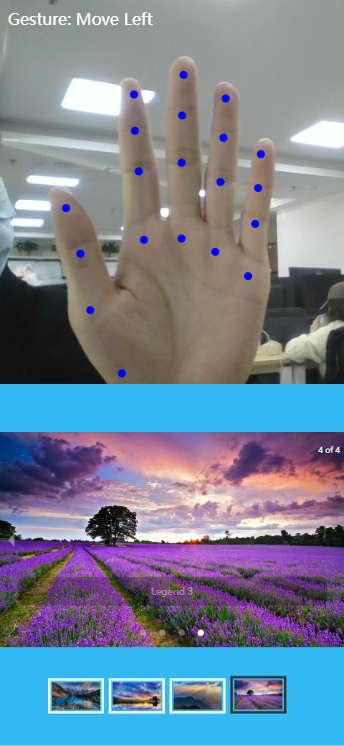

#

## 效果预览
手掌与摄像头举例需要保持在20cm以上，因为需要显示完整的手掌。
左右移动手掌可控制轮播图展示前一张或后一张。



## 模型文件
需要与@mediapipe\hands版本一致，当前为 0.4.1675469240 
>将 `node_modules\@mediapipe\hands` 的文件复制到 `public\mediapipe\hands`

## 启用https

1、安装 mkcert
　　
>Windows 环境下使用 chocolatey 安装 mkcert，首先安装 chocolatey ，管理员权限打开cmd，执行命令：

```bash
@"%SystemRoot%\System32\WindowsPowerShell\v1.0\powershell.exe" -NoProfile -InputFormat None -ExecutionPolicy Bypass -Command "iex ((New-Object System.Net.WebClient).DownloadString('https://community.chocolatey.org/install.ps1'))" && SET "PATH=%PATH%;%ALLUSERSPROFILE%\chocolatey\bin"
```
　
>choco 安装 mkcert
```bash
choco install mkcert
```

## 2、创建本地 CA
```bash
mkcert -install
```

## 在项目根目录下生成证书：
```bash
  mkcert localhost
```
这将生成两个文件：`localhost.pem` 和 `localhost-key.pem`。

## 2. **配置 Vite 开启 HTTPS**
在 `vite.config.ts` 或 `vite.config.js` 中，配置开发服务器以使用 HTTPS。

```ts
import { defineConfig } from 'vite';
import fs from 'fs';
export default defineConfig({
  server: {
    https: {
      key: fs.readFileSync('./localhost-key.pem'),  // 使用 mkcert 生成的私钥
      cert: fs.readFileSync('./localhost.pem'),     // 使用 mkcert 生成的证书
    },
    open: true,  // 自动打开浏览器
  },
});
```
确保 `localhost-key.pem` 和 `localhost.pem` 文件存在于项目根目录。